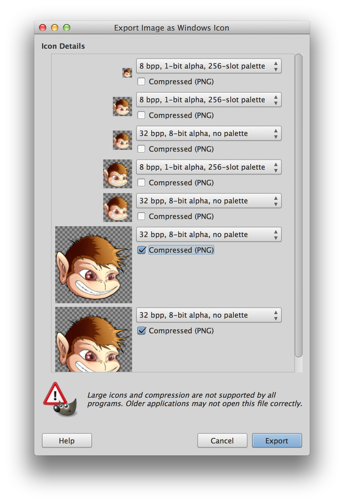

## What does this folder do?
This folder is no common resources/ folder as in it’d be processed by the build process.  
This is just for the sole purpose of storing the downsampled Icons and other resources so you don’t have to do this all over again.  

### HOW TO properly generate Icons
The process of generating Icons shouldn't be necessary but who knows  what the future brings.  
You basically have on large file (256x256px) with 32bit color-depth and have to downsample that for .ico's  

Windows Icons contain multiple images with different resolutions to pick them based on the platform.  
I included a GIMP project file, however feel free what Software you'd use.  

Essentially you have to create different layers and then the GIMP Exporter (Export -> Windows Icon) does all the work for you.  
See here for the correct configuration:  

### HOW TO Replace Icons:
When a new Netbeans Version is out you might need to redo this process since we override netbeans launcher exe with our version (and this launcher can change with a new nb version).  
See `harness-override/README.md` for more information on that subject.  

Open up `app.exe`, `app64.exe` and `pre7_app.exe` (*not* `pre7_app_w.exe`*!!*) with the `Resource Hacker` Software (or comparable).  
Open up the `Icon Group (100: 1033)` and Right-Click on it to select `Replace Icon`.  
Select `jmonkeyplatform.ico` and you’re done. (Well, save the file ;))  

Note: Your Windows has an Icon Cache so you can’t see that it actually worked.
Simply launch `ie4uinit.exe -ClearIconCache` and it should work.

[There’s](http://www.sevenforums.com/tutorials/49819-icon-cache-rebuild.html) a larger tutorial but it shouldn’t be necessary.

When you’ve changed the Icon, make sure to change the hashes in `harness-override/override.properties`
You have the „hashBefore“ and „hashAfter“. The first one is the plain .exe before changing (This is so we can see if there’s a new netbeans version without us having changed the icons/exe) and the other one is after changing. Simple, huh?

Then issue `shasum -a 256 netbeans/harness/launchers/*.exe` so you have all the hashBefore’s / After’s
See `harness-override/README.md` for more information on that subject.